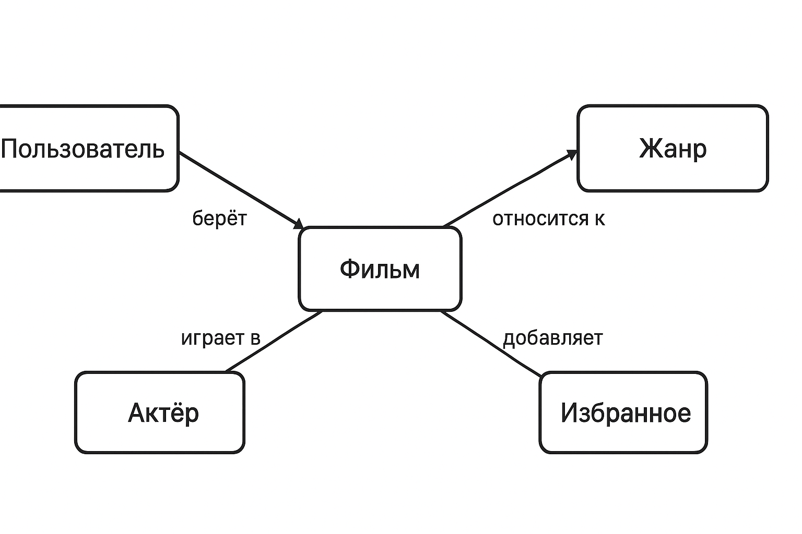

# fedorova-project
## Chat-bot  для поиска фильмов
Основная идея моего проекта заключается в создании удобного и умного помощника, который помогает людям подбирать фильмы и сериалы для просмотра. Многие сталкиваются с ситуацией, когда хочется посмотреть что-то новое, но трудно выбрать подходящий вариант. Мой бот решает эту проблему, предлагая персонализированные рекомендации на основе запросов пользователя.

Работа бота будет выглядеть следующим образом: пользователь вводит запрос, например: «Хочу посмотреть комедию» — и бот автоматически подбирает список фильмов и сериалов этого жанра. Кроме того, можно будет искать фильмы по названию, актёру, режиссёру или даже по ключевым словам, например «фильм про космос, но не фантастика».

Бот будет показывать краткое описание фильма, год выхода, рейтинг, жанр, список актёров и ссылку на трейлер, что поможет быстрее понять, подходит ли фильм для просмотра. Также будет возможность добавлять фильмы в раздел «Избранное», чтобы легко возвращаться к ним позже.

Помимо основных функций, планируется внедрить несколько дополнительных возможностей:

Раздел “Случайный фильм” — если пользователь не может определиться, бот предложит случайный вариант, подобранный с учётом предпочтений.

Персональные подборки — бот сможет запоминать понравившиеся фильмы и предлагать подборки: «Лучшие фильмы этого месяца», «Что посмотреть, если тебе понравился…».

Фильтр по настроению — пользователь сможет выбрать настроение (весёлое, грустное, расслабляющее, напряжённое), и бот предложит подходящие фильмы.

Система оценок — после просмотра пользователь может поставить фильму оценку, и бот будет учитывать её в дальнейшем, делая рекомендации точнее.

Напоминания — если выходит продолжение любимого сериала или новый фильм любимого актёра, бот сможет прислать уведомление.

Класс: Пользователь

Хранит данные о пользователе и его взаимодействии с ботом.

Поля:

user_id, username, избранное (список фильмов), история_поиска (список запросов), предпочитаемые_жанры, история_просмотров, оценки_фильмов (фильм → оценка)

Класс: Фильм

Основная сущность в проекте — единица контента.

Поля:

film_id, название, год_выхода, жанры (список Genre), актёры (список Actor), описание, рейтинг (например IMDb), ссылка_на_трейлер, длительность, страна_производства, возрастной_рейтинг

Класс: Жанр

Используется для фильтрации и рекомендации.

Поля: genre_id, название_жанра, описание, список_фильмов

Класс: Актёр

Используется для поиска фильмов по актёрам.

Поля: 

actor_id, имя, возраст, фильмы_с_участием

Класс: Избранное

Поля:

user_id, список_фильмов, дата_добавления

Класс: Рекомендация

Поля:

recommendation_id, user_id, список_фильмов, тип_подборки (жанровая, случайная, по актёру и т. д.), дата_создания

Класс: ИсторияПоиска

Поля:

user_id, запрос, дата_запроса, результаты (список фильмов)

